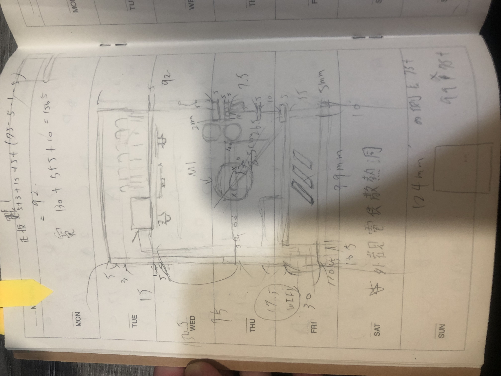
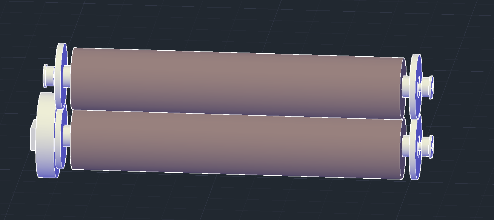
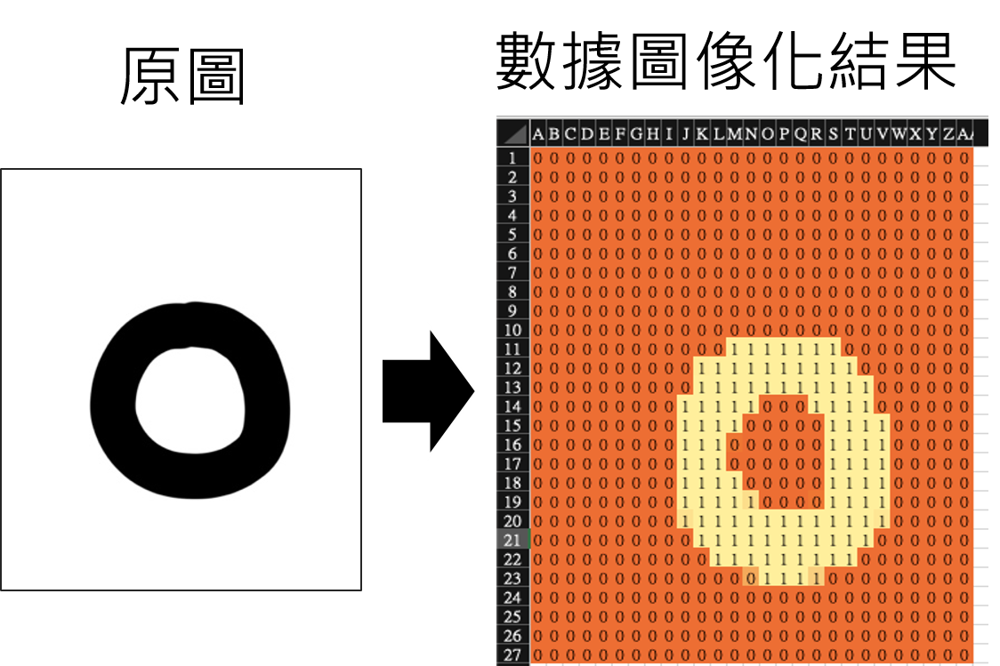
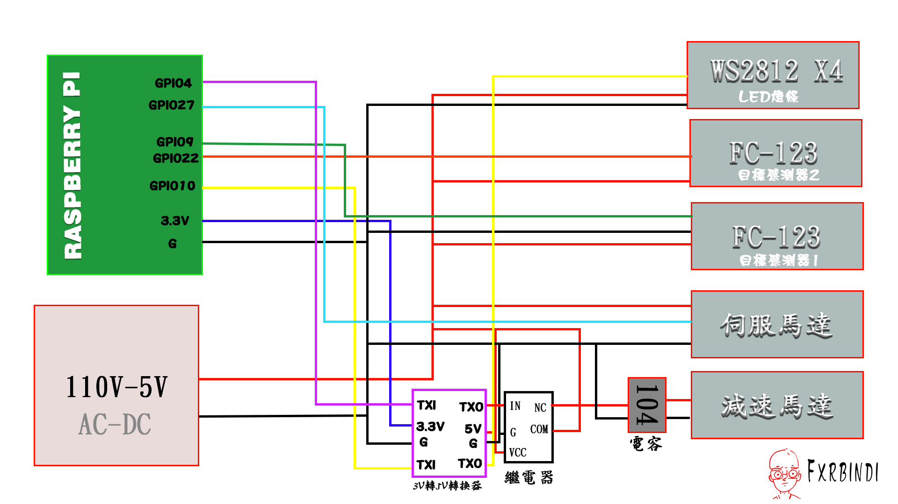
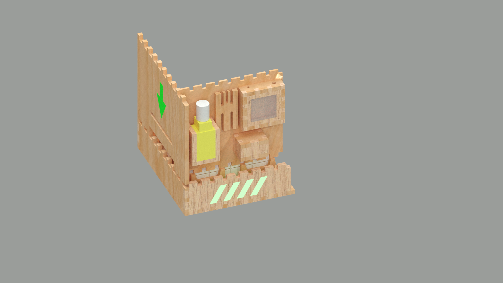
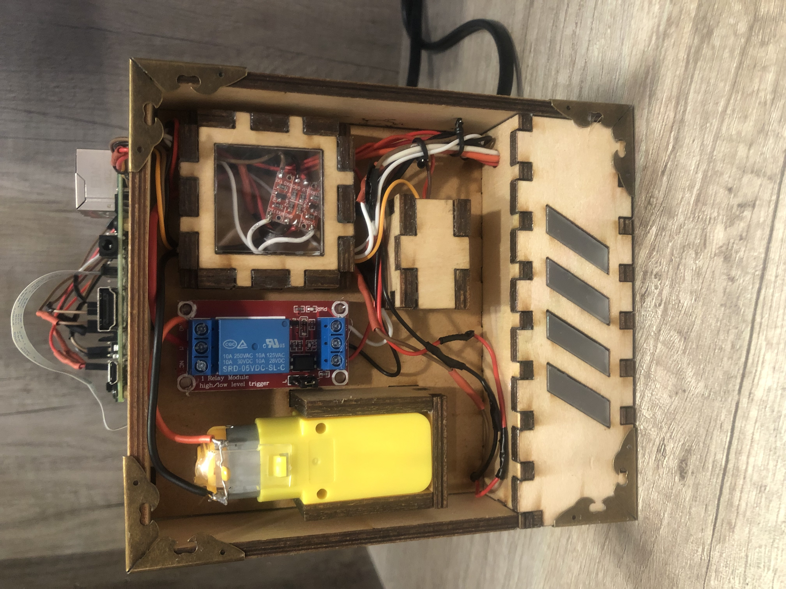
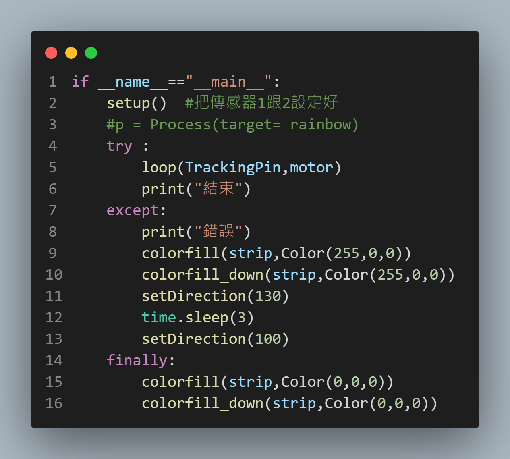

# IoT Score Machine:Deep Leaning to predict score machine 
> **學校專題-成績辨識器**
>
> 影片介紹: [執行畫面](https://www.youtube.com/watch?v=YyPfOn3d-Wk)
>
>研究動機: 為改善目前登記成績的速度以及大資料的整理


## 結構設計
>   
> 設計 : [分解環繞影片](https://www.youtube.com/watch?v=SSCol9JbORs)
> 
在影片中我的轉軸系統是利用兩串小輪胎加上齒輪然後使用減速馬達將它帶動,辨識區域是利用伺服馬達來控制倒紙作業,整個結構是利用雷射切割完成,使用的軟體是AutoCAD,整個作品使用了2D組裝的思維藉由卡扣設計進行


> 草稿圖



> 卷軸系統



## 使用器具

- 主要硬體
  - Raspberry pi 3b+
  - 減速馬達
  - 伺服馬達(mg90s)180度
  - 3.3v 轉5v電位邏輯轉換器(T74)
  - 紅外線巡跡模組(FC123) *2
  - LED燈條(WS2812)*4
  - 繼電器5v
  - AC110-DC5V電源供應
- 軟體
  - Visual Studio Code
  - AutoCad
  - Adobe Illustrator 2022
  - Adobe Photoshop 2021
  - FileZilla
- 語言
  - python
  - javascript
  - html
  - css
  - javascript
  - bootscript

## 網頁設計
 
我是使用了google-excel(當成資料庫),利用javascript讀取資料庫內的資訊並在網頁上面呈現,網頁可以對成績表做查詢,也有做RWD設計各個裝置都可以使用

> 網站介紹: [點我!!查詢請輸入【段考二】](https://script.google.com/macros/s/AKfycbwUPB8av8gJiDm0B71revtbjKE4klsRZkYY4DOG9oE/dev)


> 
>使用google-api讓python能與google-excel連上
>

## 使用方法/示例

```python
gc = pygsheets.authorize(service_account_file='project.json')
survey_url = 'your google-excel url'
sh = gc.open_by_url(survey_url)
ws = sh.worksheet_by_title('text')#你的試算表名稱
```
取得憑證(.join的檔案)後,python讀取join檔後利用這個檔案與google-api進行驗證,之後就可以操控試算表了

> [原作網址](https://hackmd.io/@Yun-Cheng/GoogleSheets)

## 關於辨識系統
> 深度學習
> 卷積神經網路(Convoluational Neural Network)
> 訓練庫 經典的手寫數字資料集【Mnist】


- [原作:OmniXRI](https://ithelp.ithome.com.tw/m/articles/10266628?sc=rss.iron)

Cnn是用來影像辨識的,它的功能用起來就像,假如我們看見一個人我們要怎麼判斷是不是人,在我們的腦袋中,眼睛會先透過把看見的東西傳回腦袋,然後我們的大腦會進行特徵的擷取並與我們認知人的特徵做對比,進行對比後發現有部分軌跡形狀相似,我們就會認為他是一個人,在電腦中是輸入,卷積層,池化層,卷積層,池化層,壓平,傳入神經元進行分析輸出0-9的機率

如何在python中使用cnn,我們會在程式中建立cnn模型,把圖片正規化,後把資料丟進去訓練,把訓練完的權重(Weights)儲存,再用訓練好的權重套到(load_weights)模型上對圖片進行預測(predict)

> 卷積模型(model)

```python
def CNN_model():
    model = keras.Sequential(name="CNN") 
    model.add(layers.Conv2D(16,(5,5),activation='relu',padding='same',input_shape=(28,28,1))) #第一層輸入
    model.add(layers.MaxPooling2D((2,2)))
    model.add(layers.Conv2D(32,(5,5),padding='same',activation='relu'))
    model.add(layers.MaxPooling2D((2,2)))
    model.add(layers.Dropout(0.25))
    model.add(layers.Flatten())#轉一維陣列
    model.add(layers.Dense(128,activation="relu"))
    model.add(layers.Dropout(0.5))
    model.add(layers.Dense(10,activation='softmax')) #0-9輸出
    model.compile(optimizer='adam',
               loss=tf.losses.SparseCategoricalCrossentropy(from_logits=True),
               metrics=['acc'])
    return model
```
> 訓練結果

  
   

> 驗證正規化(Normalization)的過程
正規化是一個在進入卷積神經網路模型之前的一個程序主要工作是將圖片改成固定格式的二維陣列


>為什麼要求證?

A:因為在進行卷積模型訓練時,我發現我丟我自己的圖片進入cnn_model進行預測時時常的預測出來的答案與我寫的數字不一樣所以我針對正規化這個部分下去做驗證看是否在input時就有問題了

> 
> 我使用了python把程式中正規化的部分逐一填入excel
> 
> 這樣就可以在excel中圖像化
> 
> 在編輯器中無法將正規化print出來所以才使用excel作為輔助



## 影像處理 

- 紙張進入後利用綠光加藍光把紅色變成黑色之後用高對比把線條的輪廓加深


- 經過侵蝕圖片的方式把小點都處理掉

- 取得圖片的輪廓進行正方形的截圖

- 對每個數字切割

> 拍攝紙張


> 處理


本來是用HSV下去做顏色的判斷後來發現不管怎麼調,截出來圖片都是一團亂,也有用YUV色彩去抓顏色,也是因為YUV對紅色及藍色有較好的辨識度所以才會用紅框,後來調光源發現在白光的照亮下我的圖上白色的部分有很多的粉紅色的光影,所以就朝著透過光源的方向去讓圖片處理得更好 

更好的方式:霍華夫取線(是一個ai對直線的算法,使用這個算法可以使圖片提取更完整)
## 線路圖



> CAD模擬各零件擺放



> 實際主裝



## 流程程式

> 初始化
> 
> 接著呼叫FC123 loop定義
> 
> 執行拍照截圖處理..等程序
> 
> except除錯程序控制燈號警示我們
> 



## 處理問題

> 伺服馬達抖動問題
> 
> WS2812 LED燈條五秒鐘後出現白光-不受控制
> 
> PMIC 損毀

### 1.伺服馬達抖動問題

> 可能的問題使由軟體模擬pwm波會有誤差值,每一個伺服馬達的誤差值都不一樣,假如開發版發出來的誤差值大於伺服馬達給出的誤差值就會出現抖動的問題

我們一剛開始應先從程式的部分下手,因為我們所用的mg90s它是屬於較便宜的馬達所以它的誤差值沒有像步進馬達那些更高階的馬達小

伺服馬達的功能與金錢成正比!!

> 伺服馬達原理(型號：mg90s)

伺服馬達是利用pwm去控制轉舵要轉幾度

 > 什麼是pwm ? 


分為硬體pwm、軟體pwm控制(現在使用的是軟體pwm)

 led燈有開跟關兩個狀態我們都是利用pin腳輸出高電壓(3.3v)或者低電壓(0v)來控制,但我們的伺服馬達有0～180度有180種狀態,所以就要使用pwm作為控制,pwm也是一種輸出高低電壓的原理,但他是使用高低電壓的時間差作為一種訊號

電源頻率50HZ,脈衝寬度500us-2500us 

1s = 1000ms ,1ms = 1000us

我們由電源頻率得知工作週期為20ms

 

伺服馬達脈衝寬度調變訊號
（Servo PWM Singal）

各角度所需要的脈衝寬度


> code
```python
#coding:utf-8
import pigpio
import RPi.GPIO as GPIO
import time
pin_servo = 27
# 終端機需輸入(才能執行pigpiod)
# sudo systemctl enable pigpiod
pwm = pigpio.pi()
pwm.set_mode(pin_servo, pigpio.OUTPUT)
pwm.set_PWM_frequency(pin_servo, 50)  # 50Hz frequency
def destroy():
    pwm.set_PWM_dutycycle(pin_servo, 0)
    pwm.set_PWM_frequency(pin_servo, 0)
# 輸入0 ～ 180度即可
# 別超過180度
def setDirection(angle):
    # 0 = 停止轉動
    # 500 = 0度
    # 1500 = 90度
    # 2500 = 180度
    duty = 500 + (angle / 180) * 2000
    pwm.set_servo_pulsewidth(pin_servo, duty)
    print("角度=", angle, "-> duty=", duty)
setDirection(100)
time.sleep(5)
setDirection(130)
#time.sleep(5)
#setDirection(100)
```
### 2.WS2812 LED燈條問題
由於WS2812 LED-Strips需要高精準度的時脈,只要接收到的訊號有錯誤就會馬上亮白光,所以我們需要透過更改系統檔的方式更改CPU的頻率,否則SPI會頻率錯誤


> Video: [SPI錯誤](https://youtube.com/shorts/EJO2xfDEh9g)

### 3.PMIC 損毀

> 這次專題中出現了兩次的晶片(PMIC)損壞

> PMIC 損壞會導致樹梅派不能開機和3.3V短路

1.	我以為HDMI是熱插拔的,所以在運行時直接拔除導致PMIC損壞
2.	在量PIN角電壓時,不小心讓5V和3.3V誤接,導致3.3V短路

> 解決方案:請專人更換PMIC(大概台幣800元)


> 可以改進的部分

 1.	在網頁中可以使用後端PHP和MYSQL去控制,做出更多的介面,和成績的分析,或者加入權限登入系統等等功能

 2.	在機器中倒紙的部分當初沒有考慮過摩擦係數的問題導致紙張本來要從前面出來的變成從後面出來,可以更改的方向是更換較光滑的材質,或者利用馬達加上橡膠的方式去把紙推出

 3.	CNN辨識的準確率,在辨識率的方面因為環境的因素有些圖片有些可能辨識不出來但還是有大概98%的準確性,可以改善問題的方式是在CNN MODEL中加入pre-train model,使用機器處理出來的圖片進行訓練

 4.	圖片處理上可以做得更好，處理線條的方式可以使用霍夫變換提取直線，會比起顏色提取好

